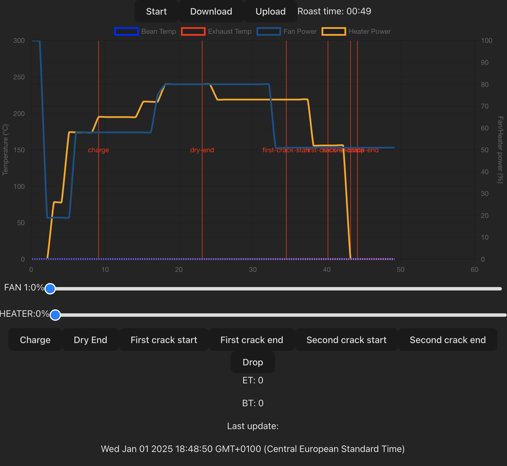
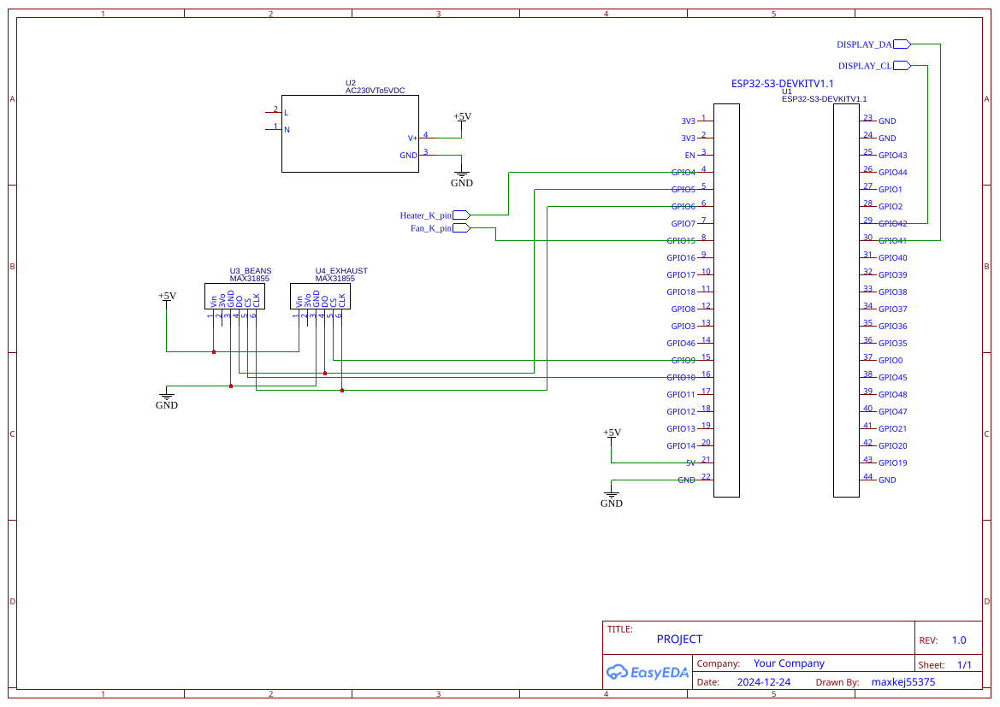

# Yaeger


## Yet another embedded gourmet experience roaster

### or something like that

## The gist

Yaeger is an embedded computer that takes control of your "coffee roaster" via Artisan-Scope.
It currently supports reading data from two temperature probes as well as controlling a fan and pulsing a heater.

### Primary goal

Is to use an old popcorn popper you have gathering dust in your basement and modifying it into a sample roaster for
roasting small batches of coffee at a time.

### Suported hardware

* [ESP32-S3 (devkit-1)](https://www.aliexpress.com/item/1005006266375800.html) or an [S3-mini](https://www.aliexpress.com/item/1005006177646698.html)
* 1 or 2 [MAX31855](https://www.aliexpress.com/item/1005006381598473.html) thermocouple chips
* 1 [DC pwm capable dimmer](https://www.aliexpress.com/item/1005006457613501.html) for the fan (must support 3.3v control)
* 1 DC controlled [AC SSR](https://www.aliexpress.com/item/4000045425145.html) for controling the heating element (same as above)

### Other required hardware for the build

* 18V DC PSU for driving the fan (be careful how you wire this)
* regular wire K-type thermocouple probe (the one that comes with your multimeter)
* flexible K-type thermocouple probe, 1x50/1.5x50 (sometimes difficult to source, they come and go on aliexpress, search for
flexible thermocouple 1x100 - this usually works).

### NOTE

We don't have enough data if there is enough difference between ET and BT to justify two thermocouples. You might use
just one.

#### Optional upgrades

* 24V DC PSU for more fan power

### Command and control


Upon first launch, Yaeger will set up its own access point. You can then configure the preferred wifi for Yaeger to
connect to from the Web UI (see below). After setting up the preffered Wifi, Yaeger will try to connect to it on every
boot. If it can't connect to the preffered Wifi, Yaeger will fallback to its own access point (so you can set up Wifi
again).
This repo also includes a sample config for Artisan-Scope.

#### Artisan Scope

Load the config, found in `./artisan-settings.aset` into Artisan-Scope, change the server ip to match yours and click the on button.

#### Web interface

You can also control Yaeger from its own web interface without an app. Just point your browser to `yaeger.local` when on
your home wifi, or `192.168.4.1` if Yaeger creates its own access point.


The web UI now includes a **Version & Network Info** section that shows the Web UI version/build timestamp and device firmware/network details (mode, SSID, IP, hostname) so you can quickly check when the currently loaded build was last updated.

### Frontend status

- `miniweb` (TypeScript + Vite) is the **only supported** web UI in this repository.
- The old `webserver` Svelte/Rollup frontend and related legacy files have been removed.
- Project scripts and firmware asset packaging target `miniweb`.

#### Using Yaeger on the go

If Yaeger can't connect to your preferred Wifi, it will create its own access point. Perfect for when out and about :grin:

## Build guide (WIP)

## What changed in this fork

If you are reviewing this fork before opening a PR against `tadelv/yaeger`, here is the practical summary:

* `miniweb` is now the canonical frontend (TypeScript + Vite). Legacy `webserver` content is gone.
* OTA uploads are now aligned with ElegantOTA (`/update`) and no longer depend on PlatformIO `espota`.
* A one-command OTA flow (`ota_update_all.sh`) now updates both LittleFS web assets and firmware in one run.
* OTA tooling is isolated in a local Python virtual environment (`.ota-venv`) to avoid polluting global Python installs.
* GitHub Actions build flow now supports PR validation and avoids publish failures on forks/non-upstream repos.

## Installation / update flows

There are now two recommended paths depending on how you connect to your board:

### 1) USB flash (first-time install or recovery)

Use this when the device is connected over USB serial:

```bash
./build_and_flash.sh s3
# or
./build_and_flash.sh s3-mini
```

What it does:
1. installs frontend dependencies with `npm ci`,
2. builds `miniweb`,
3. optionally erases flash,
4. uploads LittleFS (`buildfs` + `uploadfs`),
5. uploads firmware (`upload`).

### 2) OTA update (already deployed device on network)

Use this once the device is reachable over Wi-Fi and ElegantOTA is available:

```bash
./ota_update_all.sh s3
# or
./ota_update_all.sh s3-mini
```

What it does:
1. creates/reuses `.ota-venv`,
2. installs OTA dependencies in that venv (`platformio`, `littlefs-python`, `fatfs-ng`, `pyyaml`),
3. builds `miniweb`,
4. uploads LittleFS image over ElegantOTA,
5. uploads firmware over ElegantOTA.

If your device requires OTA credentials, set:

```bash
export YAEGER_OTA_USERNAME=admin
export YAEGER_OTA_PASSWORD='your-password'
```

(`YAEGER_OTA_USERNAME` defaults to `admin` if omitted.)

### Schema



Kicad projects for the S3 and S3 mini versions of the PCB, can be found in the PCB folder, along with a BOM for the pcb.

Courtesy of [@dlisec](https://github.com/dlisec)

### Building and flashing

A build script has been provided by [@matthew73210](https://github.com/matthew73210), so to get up and running on the
ESP, just run `./build_and_flash.sh`. Make sure to read the comments in the script. But also in the platformio.ini and choose the right board
Yaeger OTA in this project is provided by the web-based ElegantOTA handler (`/update`) and not the PlatformIO `espota`
upload protocol.

For VS Code + PlatformIO uploads via ElegantOTA, use one of these environments:

* `esp32-s3-elegantota`
* `esp32-s3-mini-elegantota`

These use a custom PlatformIO upload script that sends the built firmware to `http://yaeger.local/update` through the
same ElegantOTA mechanism used by the device web UI.

For a **single-command OTA update of the whole project** (frontend files + firmware), run:

```bash
./ota_update_all.sh s3
# or
./ota_update_all.sh s3-mini
```

This builds `miniweb`, then runs OTA in two explicit steps: (1) upload LittleFS (`buildfs` + `uploadfs`) and (2) upload firmware (`upload`). The script creates and uses a local Python virtual environment (`.ota-venv`), installs required OTA dependencies (`platformio`, `littlefs-python`, `fatfs-ng`, `pyyaml`), and auto-retries if PlatformIO reports missing Python modules.

For local frontend builds, use npm from `miniweb`:

```bash
cd miniweb
npm ci
npm run build
```

## Latest features

### PID

PID temp follower, set the temperature setpoint and the PID controller will try and follow. You'll need to find your own PID values

A controller review with alternatives (including MPC/LQR and fan min/max envelope design) is available at `docs/control_strategy_review_2026-04-14.md` (current recommendation: ADRC as primary advanced controller, with an ADRC autotune workflow proposal).

### Profile

Still in the works, but there is now a profile follower, it follows a simple .json format. You can have a go at [Gaggiuino web profiler](https://matthew73210.github.io/Gaggiuino-web-profiler/) under the _pun_ "Yägermeister Mode"


#### An example of a roast profile

```
{
  "steps": [
    {
      "duration": 10,
      "setpoint": 40,
      "interpolation": "linear"
    },
    {
      "duration": 360,
      "setpoint": 217,
      "interpolation": "ease-out"
    }
  ]
}
```

## Disclaimer

Be careful when messing about with electronics and high voltage. I can not and will not take any responsibility for any
sort of damage or injury caused by Yaeger, either directly or indirectly.
**You do this at your own risk**

## You have been warned
