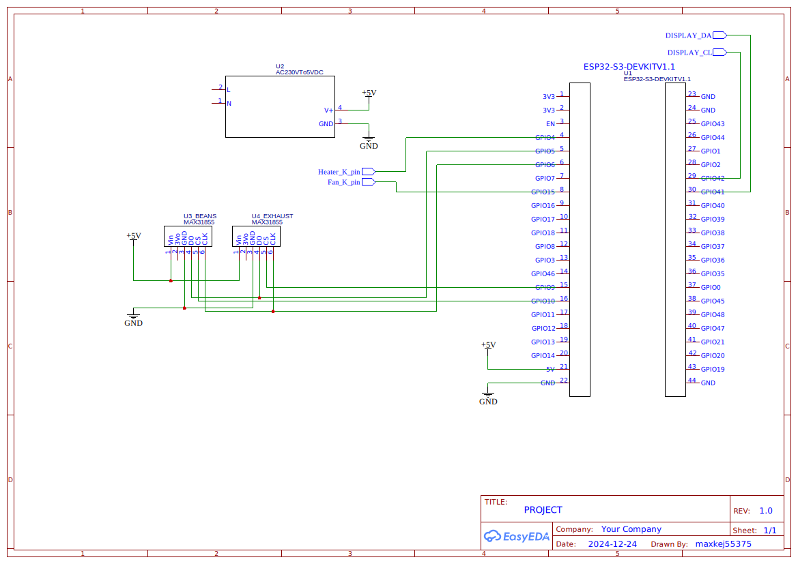

# Yaeger

## Yet another embedded gourmet experience roaster
### or something like that

## The gist

Yaeger is an embedded computer that takes control of your "coffee roaster" via Artisan-Scope.
It currently supports reading data from two temperature probes as well as controlling a fan and pulsing a heater.

### Primary goal
Is to use an old popcorn popper you have gathering dust in your basement and modifying it into a sample roaster for
roasting small batches of coffee at a time.

### Suported hardware:

* [ESP32-S3 (devkit-1)](https://www.aliexpress.com/item/1005006266375800.html) or an [S3-mini](https://www.aliexpress.com/item/1005006177646698.html)
* 1 or 2 [MAX31855](https://www.aliexpress.com/item/1005006381598473.html) thermocouple chips
* 1 [DC pwm capable dimmer](https://www.aliexpress.com/item/1005006457613501.html) for the fan (must support 3.3v control)
* 1 DC controlled [AC SSR](https://www.aliexpress.com/item/4000045425145.html) for controling the heating element (same as above)

### Other required hardware for the build:

* 18V DC PSU for driving the fan (be careful how you wire this)
* regular wire K-type thermocouple probe (the one that comes with your multimeter)
* flexible K-type thermocouple probe, 1x50/1.5x50 (sometimes difficult to source, they come and go on aliexpress, search for
flexible thermocouple 1x100 - this usually works) 

**NOTE**
We don't have enough data if there is enough difference between ET and BT to justify two thermocouples. You might use
just one. 

#### Optional upgrades:

* 24V DC PSU for more fan power

### Command and control
Upon first launch, Yaeger will set up its own access point. You can then configure the preferred wifi for Yaeger to
connect to from the Web UI (see below). After setting up the preffered Wifi, Yaeger will try to connect to it on every
boot. If it can't connect to the preffered Wifi, Yaeger will fallback to its own access point (so you can set up Wifi
again).
This repo also includes a sample config for Artisan-Scope. 

#### Artisan Scope
Load the config, found in `./artisan-settings.aset` into Artisan-Scope, change the server ip to match yours and click the on button. 

#### Web interface
You can also control Yaeger from its own web interface without an app. Just point your browser to `yaeger.local` when on
your home wifi, or `192.168.4.1` if Yaeger creates its own access point.

#### Using Yaeger on the go
If Yaeger can't connect to your preferred Wifi, it will create its own access point. Perfect for when out and about :)

## Build guide (WIP)

### Schema

Kicad projects for the S3 and S3 mini versions of the PCB, can be found in the PCB folder, along with a BOM for the pcb.

Courtesy of [@dlisec](https://github.com/dlisec)

### Building and flashing
A build script has been provided by [@matthew73210](https://github.com/matthew73210), so to get up and running on the
ESP, just run `./build_and_flash.sh`.

# Disclaimer
Be careful when messing about with electronics and high voltage. I can not and will not take any responsibility for any
sort of damage or injury caused by Yaeger, either directly or indirectly.
**You do this at your own risk**
### You have been warned!
